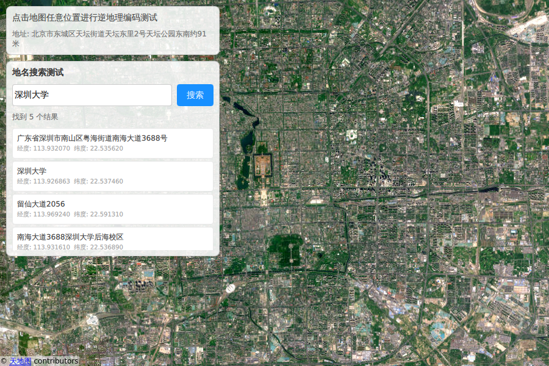

# TianDiTu Location Plugin

[中文](README.zh.md) | [English](README.md)

A Qt Location Service Provider Plugin that enables seamless integration of TianDiTu (天地图) and other map services into Qt applications.

[](https://opensource.org/licenses/MIT)



## Features

- 🗺️ **TianDiTu Integration** - Full support for TianDiTu online and offline mapping services
- 💾 **Tile Caching** - SQLite-based tile caching for offline usage
- 🔧 **Flexible Configuration** - JSON-based configuration for easy customization. Configure any map source through resources_url_config.json

## Requirements

- Qt 6.5+
- CMake 3.22+
- C++17 compiler

## Installation

### From Source

1. **Clone the repository to your project directory**
   ```bash
   git clone https://github.com/xiethon/TiandituPlugin.git
   ```

2. **CMake Configuration**
   ```bash
   add_subdirectory(TiandituPlugin)
   target_link_libraries(${YOUR_PROJECT_NAME} PRIVATE TiandituPlugin)
   ```

3. **Build Example**
   ```bash
   cmake -B build -DBUILD_EXAMPLE=ON
   cmake --build build -j $(nproc)
   ./build/example/location-example
   ```

## Usage

Using TianDiTu plugin in QML:

```qml
Map {
    plugin: Plugin {
        name: "Tianditu"
        PluginParameter {
            name: "Tianditu.token"
            value: "Your TianDiTu API Key" 
        }
    }
    // ...
    Component.onCompleted: {
        setActiveMap("Tianditu", MapType.SatelliteMapDay);  // Set to satellite imagery
    }
}
```

For more details, see the example code [Example.qml](example/Example.qml)

### Configuring Other Map Sources

Configure other map sources through **resources_url_config.json**. Example using Amap (高德地图):

```json
{
    "pluginName": "Tianditu",
    "mapSources": [
        {
            "provider": "Amap",
            "copyright": "&copy; <a href='https://lbs.amap.com/'>Amap</a> contributors",
            "styles": [
                {
                    "style": "StreetMap",
                    "url": "https://webst01.is.autonavi.com/appmaptile?style=8&x={x}&y={y}&z={z}"
                },
                {
                    "style": "SatelliteMapDay",
                    "url": "https://webst01.is.autonavi.com/appmaptile?style=6&x={x}&y={y}&z={z}"
                },
                {
                    "style": "TerrainMap",
                    "url": "https://webrd04.is.autonavi.com/appmaptile?lang=zh_cn&size=1&scale=1&style=7&x={x}&y={y}&z={z}"
                },
                {
                    "style": "CustomMap",
                    "url": "https://webst01.is.autonavi.com/appmaptile?style=8&x={x}&y={y}&z={z}"
                }
            ]
        }
    ]
}
```

**Parameters:**
* `provider`: Map provider name, corresponds to the first parameter in `setActiveMap()`
* `style`: Map style, corresponds to the second parameter in `setActiveMap()`

**Usage Example:**

Set Amap satellite imagery: `setActiveMap("Amap", MapType.SatelliteMapDay)`

> **Note**: Some map sources require an API token for access. Please refer to each map provider's service policy.

For more available map sources in China, see [resources_url_config.json](assets/resources_url_config.json)

## License

This project is licensed under the MIT License - see the [LICENSE.md](LICENSE.md) file for details.

## Support

- 📧 Email: xiethon@163.com, xiethon2020@gmail.com
- 🔗 Repository: https://github.com/xiethon/TiandituPlugin

- Initial development: [Your Name]

## Support

For issues, questions, or suggestions:

- 📧 Email: [your-email@example.com]
- 🐛 Issues: [GitHub Issues](https://github.com/yourusername/LocationPlugin/issues)
- 💬 Discussions: [GitHub Discussions](https://github.com/yourusername/LocationPlugin/discussions)

## References

- [Qt Location Module Documentation](https://doc.qt.io/qt-6/qtlocation-index.html)
- [TianDiTu Maps](https://www.tianditu.gov.cn/)
- [CMake Documentation](https://cmake.org/documentation/)

---

Made with ❤️ for the Qt community
